# 🚀 Atlassian App Analytics

Customer Behaviour Analytics Platform for Atlassian Marketplace Apps.

## Screenshots

### Landing Page
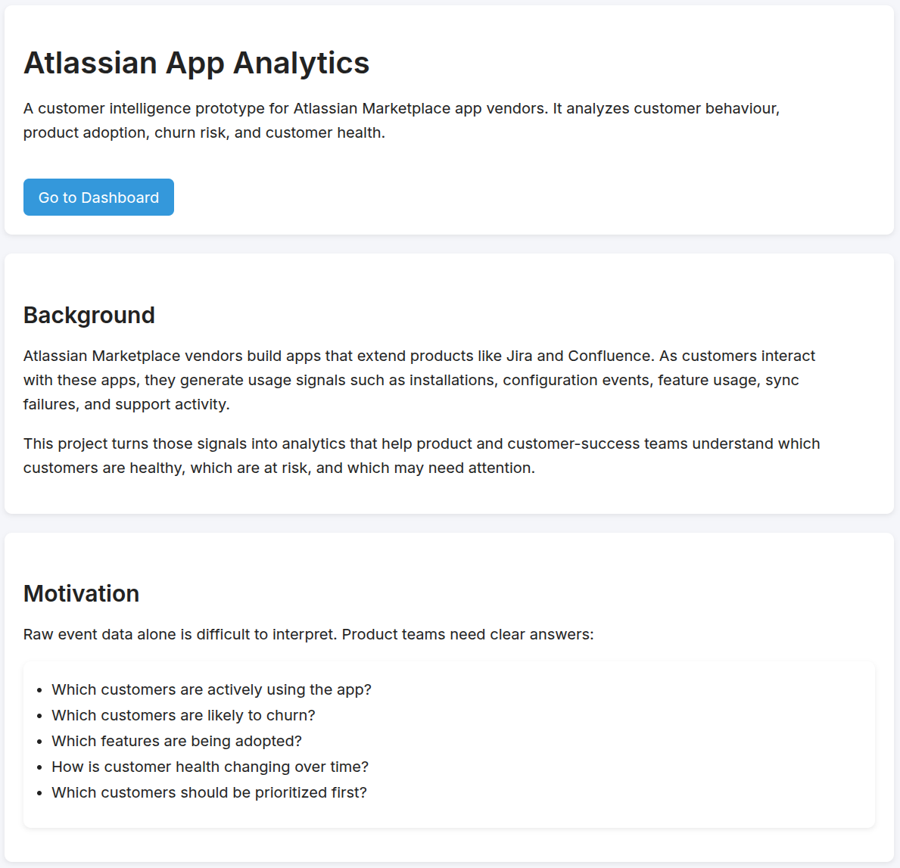
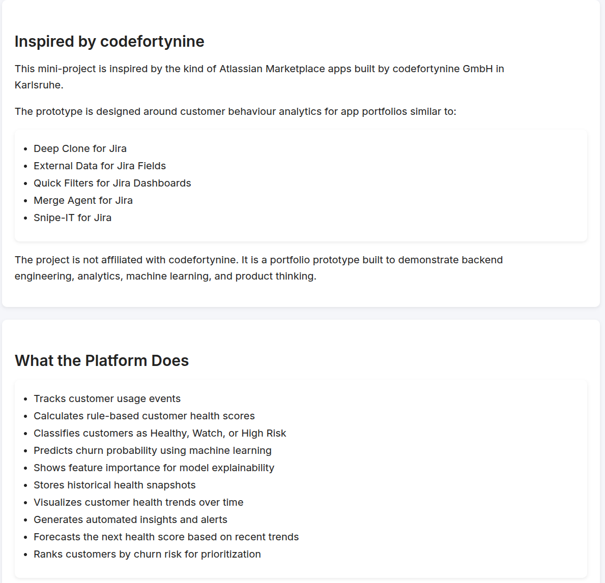
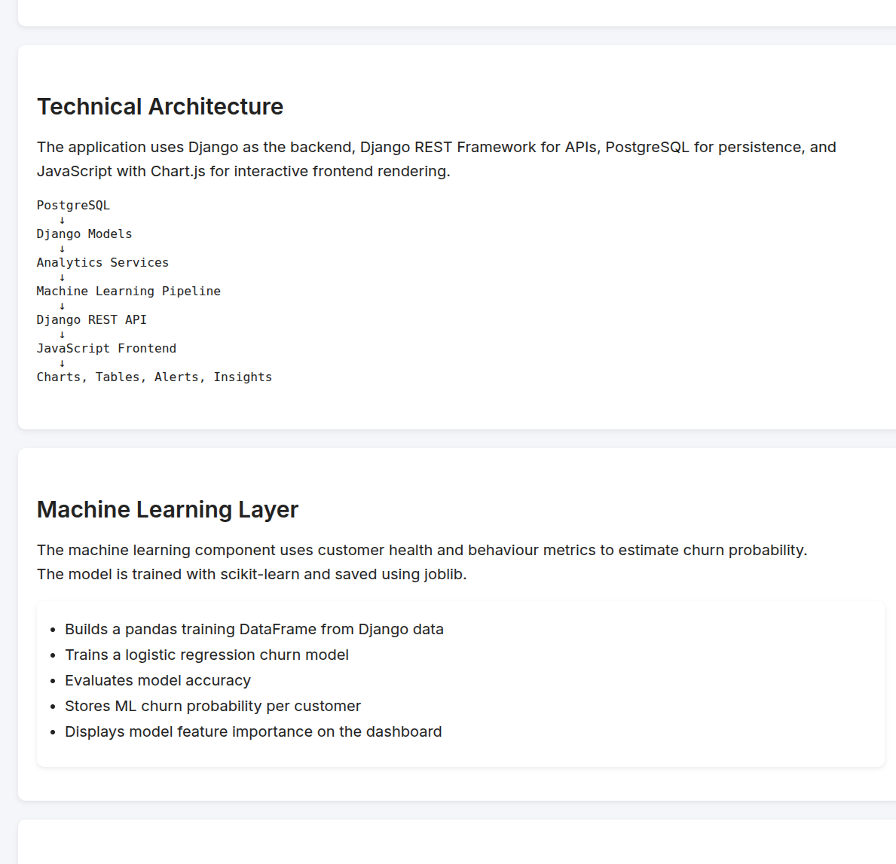
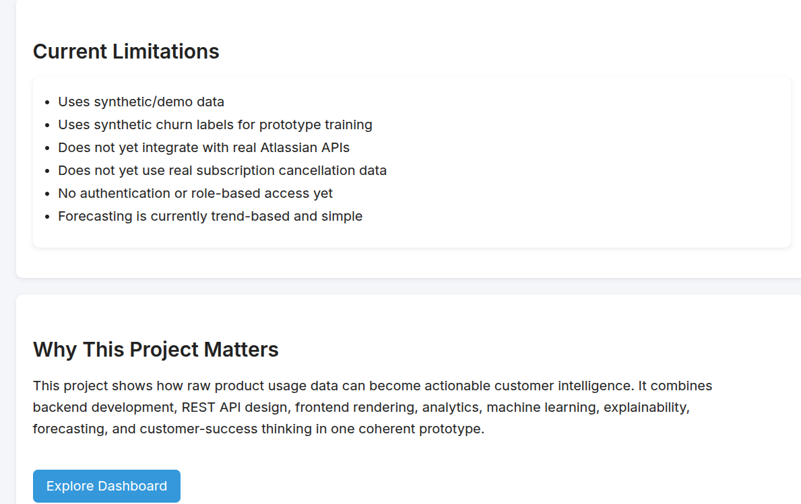

### Dashboard
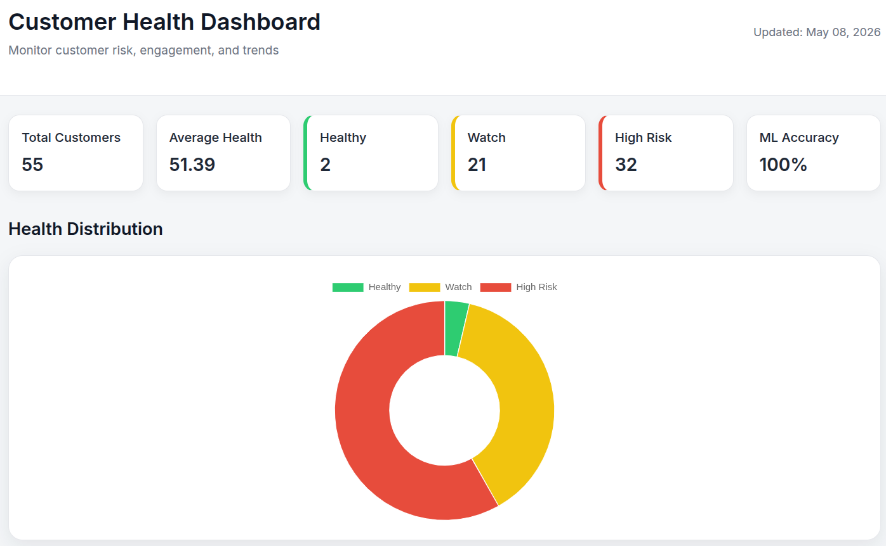
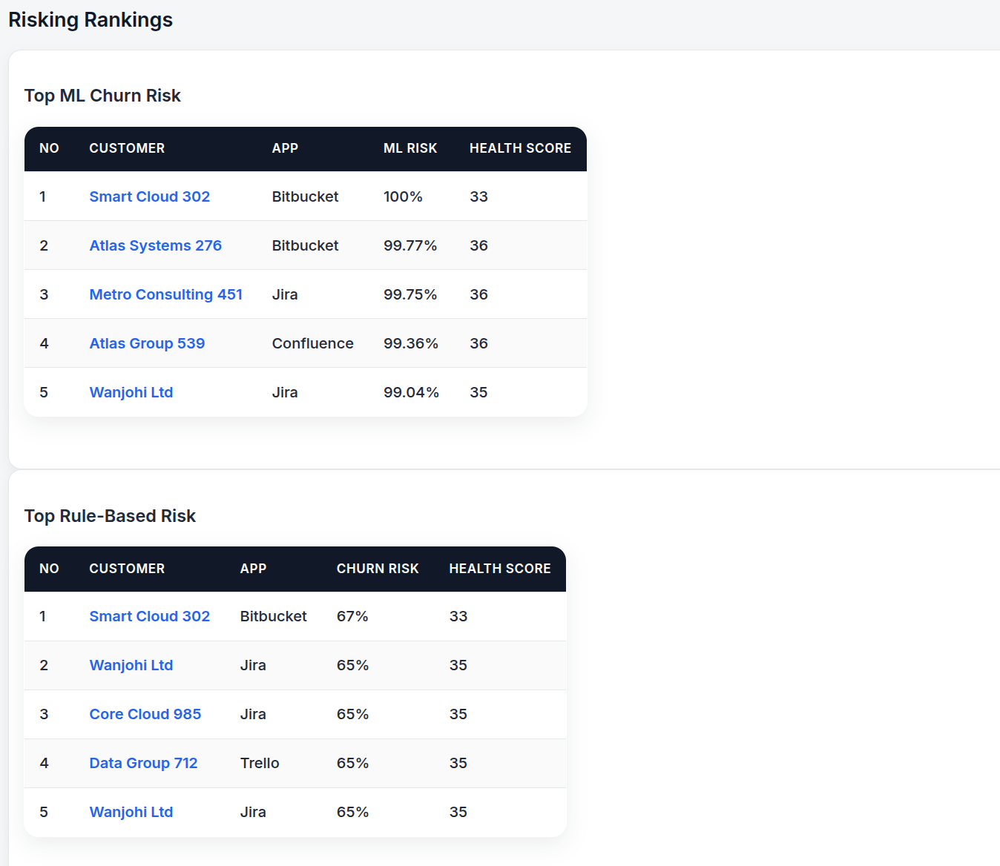
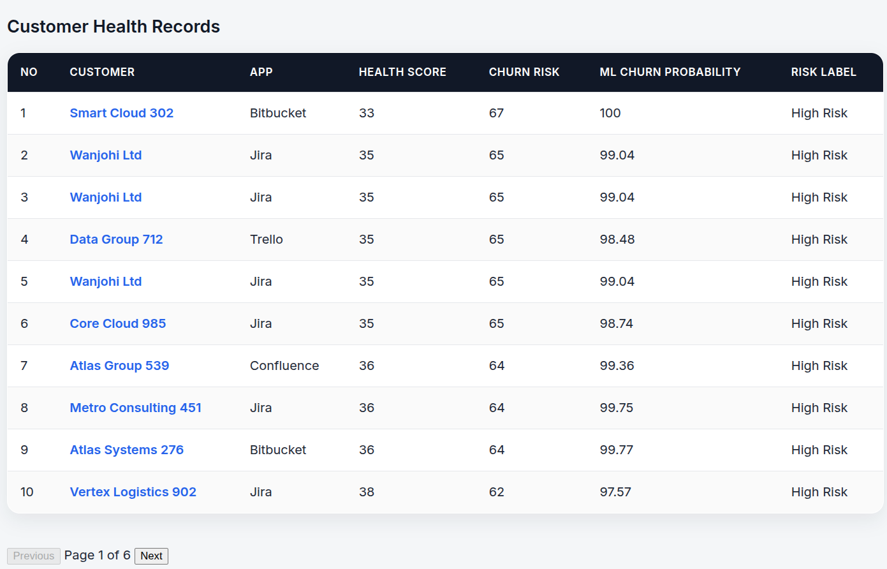

### Customer Detail Page
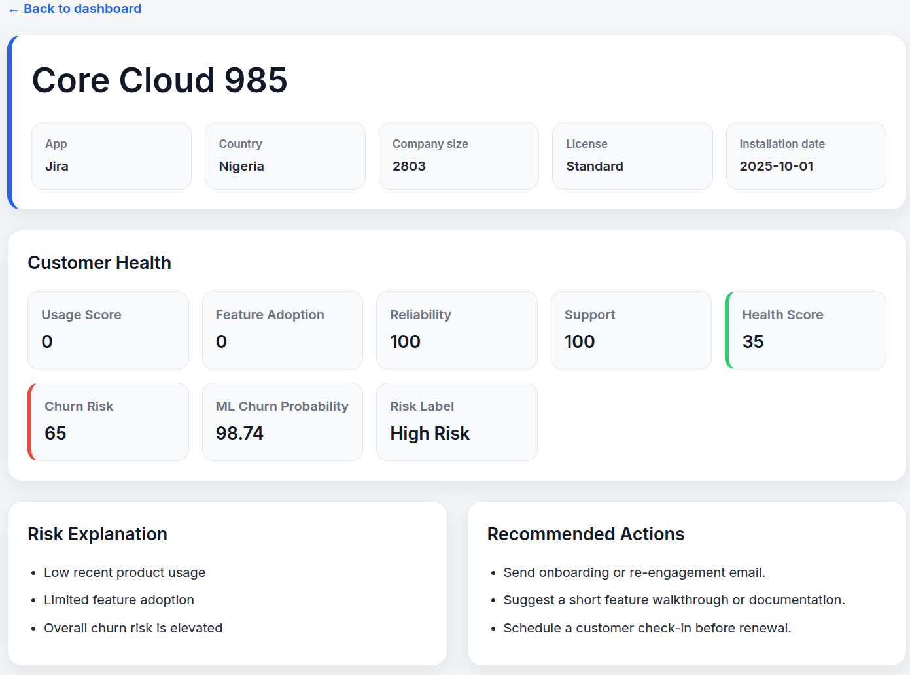
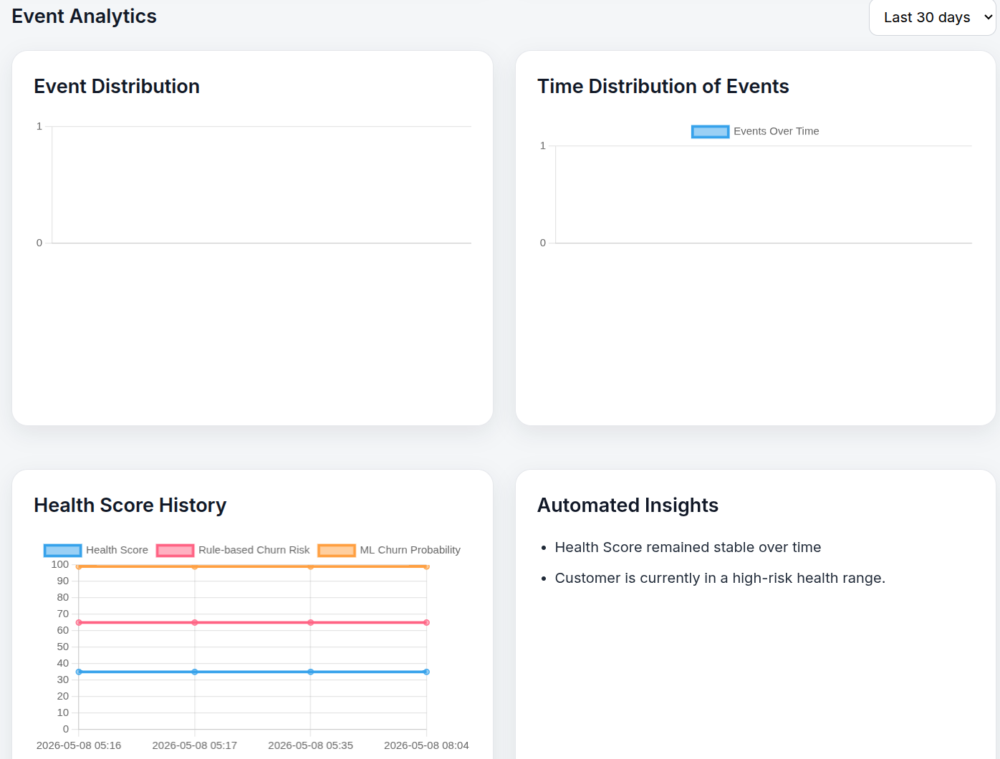
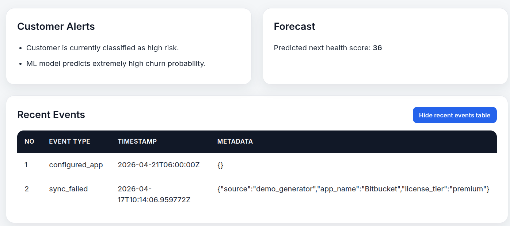

### ML Feature Importance
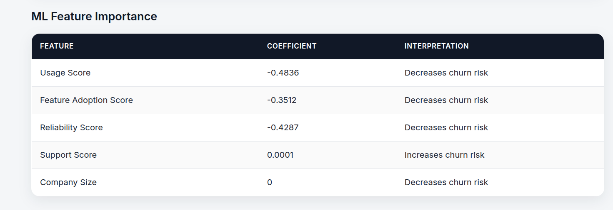
